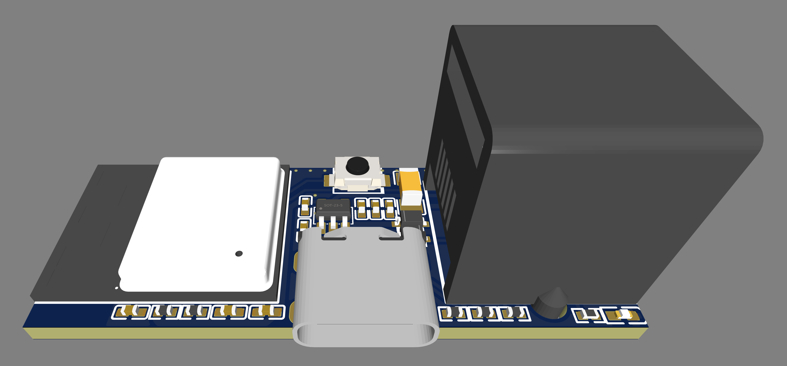

# SlimmeLezer Mini
SlimmeLezer Mini with ESP32-C3


## The new successor for the SlimmeLezer
A powerfull small compact redesign with allmost the same measurements: 16 x 41 mm 
- ESP32 C3
- Power and statusled

### Important pin-out

Uart:
```YAML
uart:
  - id: p1_uart
    rx_pin:
      number: 20
      inverted: true
    baud_rate: 115200
    rx_buffer_size: 1700
```
Button (for flashing and factory reset)
```YAML
binary_sensor:
  - platform: gpio
    name: "Reset switch GPIO9"
    id: reset_button
    pin: 
      number: GPIO09
      mode:
        input: true
        pullup: true
```
Status LED
```YAML
status_led:
  pin:
    number: GPIO08
    inverted: true
    id: led
```
